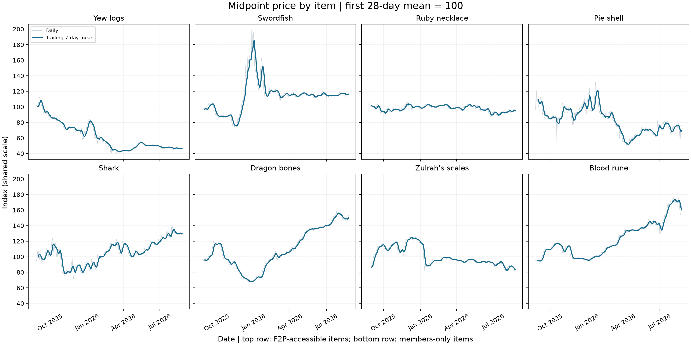
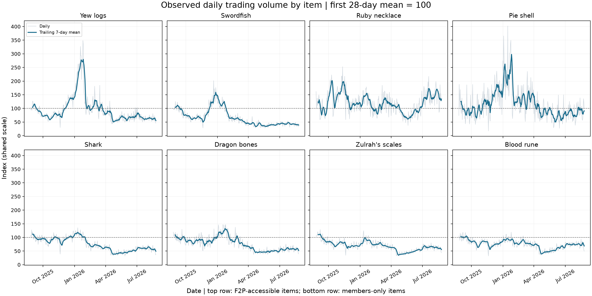

# OSRS Market Data Analysis

An exploratory study of Old School RuneScape Grand Exchange prices and observed trading volume for eight items. This repository develops a school project through public revisions. The original runnable version is preserved in the `school-project-baseline` tag.

The historical snapshot contains **2,920 daily observations**, with **365 observations per item**, from **August 26, 2025 through August 25, 2026 (UTC)**. It includes no missing values or duplicate item/timestamp pairs.

## What the analysis does

The scripts inspect raw market observations, construct a midpoint of the reported high and low transaction averages, combine the two reported volume categories, and compare indexed price and volume histories. Price indices begin at 100 for each item. Volume indices use the mean of each item's first seven observations as 100.

The report discusses market changes alongside anti-cheat enforcement. The workflow now aligns six verified monthly enforcement observations with market data and generates descriptive correlations in levels and month-to-month changes. The results do not establish that enforcement caused the observed changes. The selected items are a small sample of the economy, and the API observations are not a complete census of Grand Exchange transactions.

## Read the analysis

- [Enforcement and market associations](docs/enforcement_associations.md)
- [Enforcement source audit](docs/enforcement_source_audit.md)
- [Quantified trends and baseline sensitivity](docs/trend_comparisons.md)
- [Original school report, converted to Markdown](docs/original_report.md)
- [Public revision roadmap](ROADMAP.md)





The midpoint is an unweighted average of two reported transaction-price averages, rather than a volume-weighted market price. Indices depend on the chosen baseline period. The new charts show daily measurements and trailing seven-day means in separate panels, with each item indexed to its first 28-day mean. The five original charts retain their original normalization. Calendar-window comparisons and seven-versus-28-day endpoint checks are generated alongside them.

## Reproduce the historical analysis

Use Python 3.11 or newer and run the commands from the repository directory.

```sh
python -m venv .venv
```

Activate the environment on Windows:

```powershell
.venv\Scripts\Activate.ps1
```

Or on macOS/Linux:

```sh
source .venv/bin/activate
```

Install dependencies and reproduce the historical analysis with one command:

```sh
python -m pip install -r requirements.txt
python run_analysis.py
```

This command inspects the saved raw data, rebuilds the processed CSV, and saves eight charts in `figures/`, four comparison tables in `tables/`, and two generated analysis reports in `docs/` without opening windows or accessing the network. Paths are anchored to the project directory, so the script also works when called by its full path from another folder.

To display the charts while saving them:

```sh
python run_analysis.py --show
```

Close each plot window to continue. The historical raw snapshot is left unchanged; the processed CSV and figures are regenerated.

## Optional live data collection

```sh
python collect.py
```

This separate command requires internet access and saves new data to `data/snapshots/<UTC timestamp>/osrs_market_data_raw.csv`. It leaves the historical study unchanged. The API returns currently available observations rather than the fixed dates of the study.

You can supply a new output path explicitly:

```sh
python collect.py --output data/my_new_snapshot.csv
```

The collector refuses an existing output file before making requests and creates its CSV exclusively to avoid accidental replacement. `run_analysis.py` continues to use the historical snapshot; analysis of new snapshots is a future extension.

The collector identifies itself with a User-Agent. Update that identifier for your own use in accordance with the API's documentation. Live requests were not run during this revision; snapshot handling was checked with fixture data.

## Repository files

| File | Purpose |
| --- | --- |
| `run_analysis.py` | Reproduce the complete historical analysis |
| `config.py` | Shared paths, item groups, and API URL |
| `collect.py` | Collect a separate new market snapshot |
| `inspect_data.py` | Inspect raw data and save the price distribution chart |
| `process.py` | Construct dates, midpoint prices, total volume, and indices |
| `plot.py` | Save original indexed price and volume charts |
| `compare.py` | Generate item panels, descriptive comparisons, sensitivity tables, and the trend report |
| `enforcement.py` | Align verified monthly enforcement figures with market observations and generate descriptive associations |
| `data/` | Fixed raw snapshot and reproducible processed data |
| `figures/` | Five original charts, two item-panel charts, and an enforcement timeline |
| `tables/` | Calendar comparisons, endpoint sensitivity, aligned enforcement observations, and correlations |

The original numbered scripts are available in the `school-project-baseline` tag. The Word submission and contextual enforcement workbook remain local; they are not runtime dependencies.

## Sources and reproducibility

Market data were collected from the [OSRS Wiki real-time price API](https://oldschool.runescape.wiki/w/RuneScape:Real-time_Prices), using its `/mapping` and `/timeseries` endpoints with `timestep=24h`. The stored timestamps establish the observation period; the original collection time and original dependency versions were not recorded. Third-party data retain their source terms.

The original report contains its own references and an acknowledgment of ChatGPT assistance. That acknowledgment is preserved in the Markdown version. The public baseline preparation verified all four offline scripts, reproduced the processed CSV within floating-point tolerance, and regenerated five figures. The dependency list is not an exact lockfile of the original school environment.

The first workflow revision was verified from outside the project directory with network requests disabled. It reproduced the processed CSV within floating-point tolerance and all five figures pixel for pixel. Separate fixture checks verified that collection refuses existing files and defaults to a new snapshot directory.

## Data validation and tests

Before generating outputs, the historical workflow checks required fields, finite numeric values, positive prices and item IDs, nonnegative whole-number volumes, identifier consistency, duplicate item/timestamp pairs, UTC daily intervals, a shared observation period, and the configured eight items and fixed historical dates. Each item needs at least seven observations and a positive first-seven-day volume baseline. Zero-volume days are allowed when that baseline is positive. Input rows are not silently discarded or imputed.

New collections follow the same complete-daily-snapshot rules and must match the requested items. Missing prices, gaps, unequal coverage, and malformed API responses produce an error rather than a misleading analysis. This is an intentionally strict policy for this study, not a claim that all valid API responses will have complete coverage. Failed validation leaves existing analysis outputs unchanged.

Each new snapshot has a `.metadata.json` sidecar containing collection times in UTC, API parameters, item IDs, observed coverage, Python and dependency versions, and the CSV SHA-256 checksum. Historical metadata records only what can be established from the stored snapshot; unavailable original collection details are marked null.

Run the offline tests from the repository directory:

```sh
python -m unittest discover -s tests -v
```

The tests include historical result regression, invalid measurements, daily gaps, duplicate observations, unusable baselines, malformed API payloads, output preservation, and snapshot provenance. API tests use fixtures and make no live requests.

## What the quantified comparisons show

Relative to September–December 2025, July 2026 mean daily observed volume is lower for seven of eight selected items. Ruby necklaces are the exception. First-versus-last seven-day and 28-day means also show volume declines for those same seven items.

July mean midpoint prices are higher for Blood runes, Dragon bones, and Sharks, and lower for Zulrah's scales. Among the F2P-accessible items, Swordfish prices are higher while Yew logs, Ruby necklaces, and Pie shells are lower. This supports different price patterns across the selected markets rather than uniformly stagnant F2P prices.

The generated report gives each item's changes and the exact comparison windows. Comparing mean levels does not establish a steady within-period decline, reduced volatility, statistical significance, or an enforcement effect. The original narrative remains available for comparison as the study develops.

## Enforcement context

The verified analysis covers February–July 2026 and uses archived Jagex monthly OSRS figures. January's cited archive was unavailable during review, so January is retained in the workbook transcription but excluded from comparisons. Months without enforcement observations are not treated as zero, and partial market months are excluded.

The source audit documents corrected wealth-removal units, rounding, and inconsistencies between summed monthly values and published year-to-date values. Monthly figures are used directly rather than reconstructed from cumulative totals. The wealth metric changes source labels, so it is retained as context and excluded from correlations until continuity of its definition is established.

Macro and RWT bans are compared separately with monthly mean daily observed volume and midpoint price. Level correlations use six months; first-difference correlations use five monthly changes. This short observational series supports descriptive exploration rather than causal or predictive inference. Item accessibility does not identify the account types trading those goods.

The published inputs include the original workbook transcription, the verified monthly CSV, and source provenance. Excel is not required to run the analysis, and the original workbook remains unchanged locally. Fifteen offline tests cover historical regression, invalid inputs, complete-month alignment, cumulative-count rejection, and correlation sample sizes.
