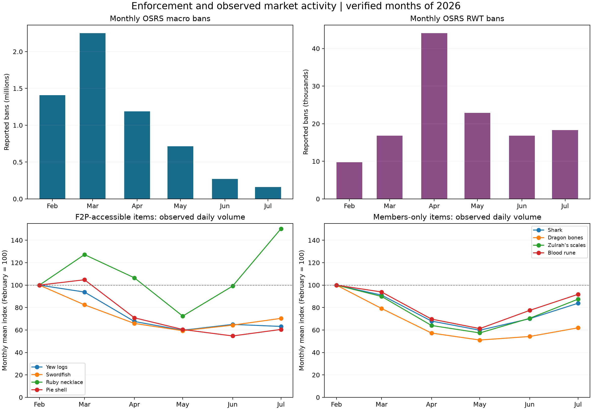

# Enforcement and Market Associations

The analysis aligns six verified calendar months, February–July 2026. January is excluded because its cited archive could not be verified. Each month has complete daily market coverage for all eight items; incomplete August months are excluded. No missing enforcement month is treated as zero.

## Verified monthly context

| Month | Macro bans | RWT bans | Wealth removed (GP) |
| --- | ---: | ---: | ---: |
| 2026-02 | 1.41M | 9,748 | 2.43T |
| 2026-03 | 2.25M | 16,831 | 3.67T |
| 2026-04 | 1.19M | 44,069 | 8.79T |
| 2026-05 | 712,870 | 22,888 | 4.76T |
| 2026-06 | 270,701 | 16,789 | 3.37T |
| 2026-07 | 159,791 | 18,302 | 4.68T |

M denotes millions and T trillions. These are monthly OSRS figures, not cumulative year-to-date totals. Rounded source values remain approximate. See the [source audit](enforcement_source_audit.md) for URLs, transcription discrepancies, and missing account-category breakdowns.

Market volume is a mean per observed day, while bans are counts per calendar month. The bottom panels show each item relative to its February mean. This display supports timing comparisons rather than a direct comparison of units.

## Descriptive correlations

Pearson correlations below use six monthly level observations or five consecutive month-to-month changes. First differences subtract the prior monthly value; they are not percentage changes. They reduce the influence of shared trends without controlling for other causes.

| Item | Macro / volume levels | RWT / volume levels | Macro / volume changes | RWT / volume changes |
| --- | ---: | ---: | ---: | ---: |
| Blood rune | +0.35 | -0.64 | +0.29 | -0.49 |
| Dragon bones | +0.61 | -0.55 | -0.08 | -0.58 |
| Pie shell | +0.91 | -0.31 | +0.82 | -0.49 |
| Ruby necklace | +0.02 | -0.11 | +0.56 | +0.07 |
| Shark | +0.49 | -0.61 | +0.26 | -0.49 |
| Swordfish | +0.57 | -0.55 | -0.14 | -0.51 |
| Yew logs | +0.79 | -0.47 | +0.46 | -0.68 |
| Zulrah's scales | +0.38 | -0.66 | +0.23 | -0.53 |

Full correlations, including midpoint prices, are in [enforcement_associations.csv](../tables/enforcement_associations.csv). The aligned monthly observations and source fields are in [monthly_enforcement_market.csv](../tables/monthly_enforcement_market.csv). Wealth removal is excluded from correlations because the source label changes from GP / Gold Removed to Wealth Removed, and continuity of that definition has not been established.

## Interpretation

The verified macro-ban series peaks in March and falls through July; RWT bans peak in April. Observed volume does not follow a uniform response across the eight items. A positive correlation can arise when ban counts and observed volume both decrease over time. It does not mean that bans increase trading, just as a negative correlation would not establish that bans reduce trading.

Six months provide very little evidence for a causal or predictive model. Correlations are descriptive, have no reported significance tests, and are sensitive to individual months, shared trends, time dependence, and reporting precision. No lag was selected to maximize an association. Updates, seasonality, player activity, demand, reporting coverage, and other market forces are not controlled.

Bans measure reported actions rather than the prevalence of bots or enforcement effectiveness. Macro and RWT counts may overlap and are not combined as unique accounts. Account categories must not be matched mechanically to item accessibility. The original broader volume-decline findings remain supported; the enforcement comparison adds context, not an isolated explanation.
