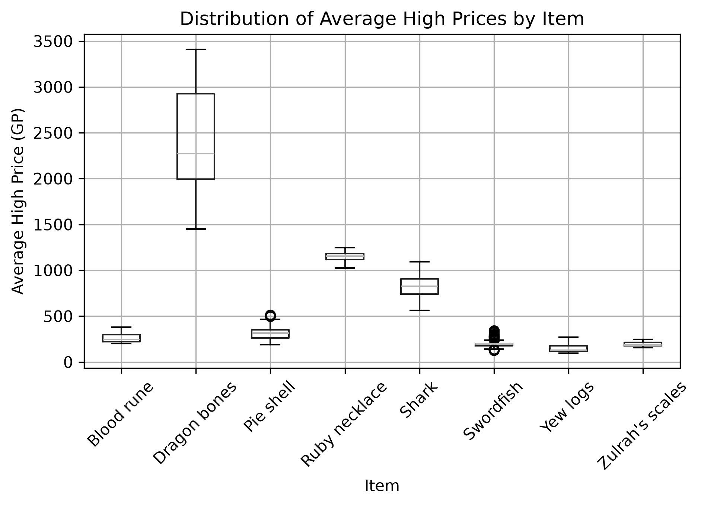
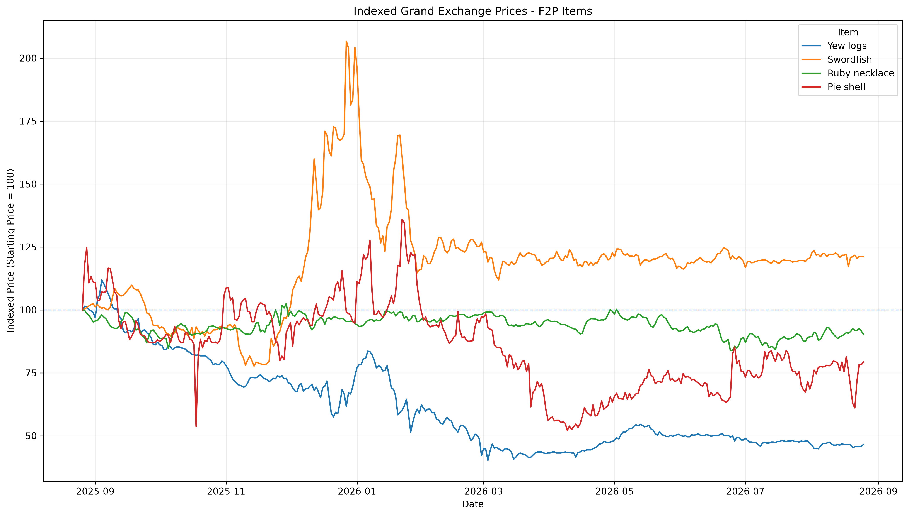
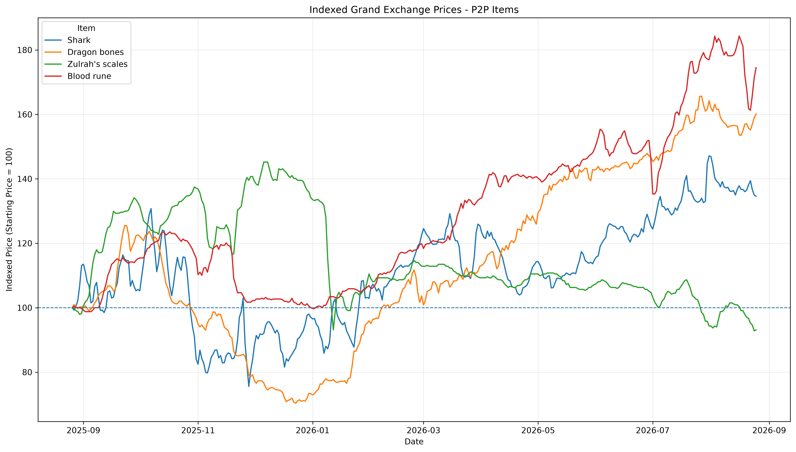
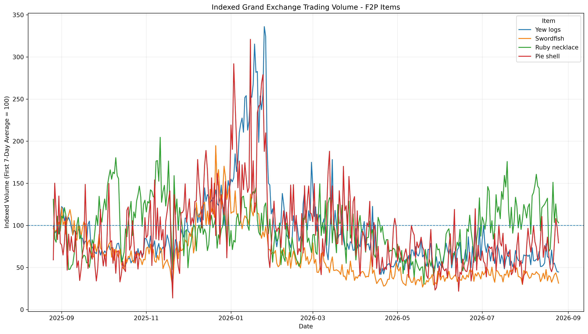
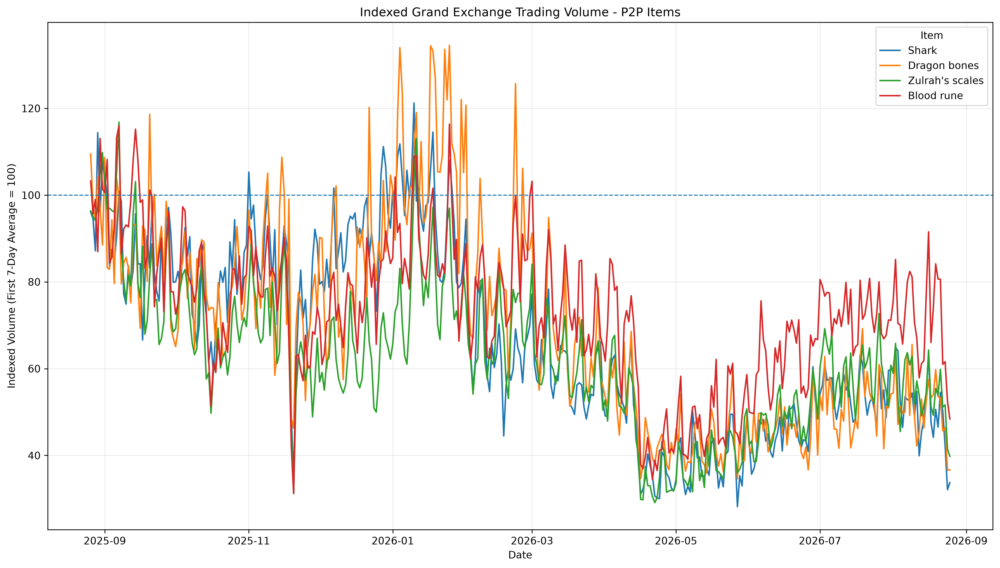

# Original School Report

Author: Benjamin Meyer

Original title: *Effects of Anti-Cheating Enforcement on Old School RuneScape Economy*

> This is the original report converted from the Word submission for public revision. Its narrative and references are preserved; the code appendix is represented by the scripts in this repository. The study is exploratory and does not establish causal effects of enforcement. Figures below were regenerated from the historical snapshot.

## Introduction

## Problem Domain

A unique mix of nostalgia, innovation, and community-based development, Old School RuneScape (OSRS) holds a distinctive place in the video game industry. Based on a 2007 backup of RuneScape, OSRS is a massively multiplayer online role-playing game centered on point-and-click controls and an open-world sandbox (Wood, 2021). With relatively little direction imposed by the game, players establish their own goals, develop their characters, and explore an expansive game world. Community participation also plays an important role in development, with many major additions and changes shaped through in-game player polls. Since its release in 2013, weekly updates have allowed the game to evolve substantially while retaining its original design.

Even so, one core feature remains fundamental to OSRS. The game has an unusually demanding progression system (Wood, 2021). Achieving the highest levels can require hundreds of hours of training for an individual skill, and the game currently contains twenty-four skills. As a result, progression can require an extraordinary investment of player time.

Players using the standard account type can reduce some of this time burden through trade. The Grand Exchange functions as the game's centralized marketplace, allowing players to offer items for gold (GP) or gold for items. According to the OSRS Wiki, “Trades succeed when one player's buy offer is greater than or equal to another player's sell offer” (Old School RuneScape Wiki, n.d.). In this way, Grand Exchange prices are shaped by changing levels of supply and demand. Changes in production, consumption, or availability of widely traded items become visible through both prices and trading volume.

Some players circumvent the game's time requirements through activities prohibited by Jagex, including botting and Real World Trading (RWT). Botting uses software to automate gameplay. For example, an automated account might repeatedly gather and then bank resources without direct player input. RWT occurs when in-game wealth or items are exchanged for real-world money. Although botting and RWT are distinct behaviors, they can interact economically when automated accounts are used to generate resources or gold for illicit sale.

Both activities have presented persistent enforcement challenges throughout RuneScape's history. In late 2025, Jagex announced changes to its RWT enforcement strategy and the deployment of new detection systems (Jagex, 2025). During the first seven months of 2026, Jagex reported more than seven million OSRS macro bans, alongside substantial enforcement against accounts involved in RWT (Jagex, 2026).

Against this background, the following exploratory data analysis examines changes in Grand Exchange market activity during a period of unusually high anti-cheat enforcement. Using one year of daily market observations collected through the OSRS Wiki's real-time price API, the analysis applies descriptive statistics, visualization, and data transformation to eight frequently traded items (Old School RuneScape Wiki, n.d.). In particular, the study focuses on the relative prices of each of these items and trading volume for them over time.

## Exploratory Analysis

The dataset used in this study was collected from the Old School RuneScape Wiki’s Grand Exchange price API. The API aggregates market observations reported through RuneLite, a widely used open-source game client. The API provides observed historical price and trading-volume information for Grand Exchange items. A Python script was used to retrieve one year of daily observations for eight selected items. The complete data-collection script is included in the appendix.

The resulting dataset contains 2,920 observations and seven variables. Each of the eight selected items contributes 365 daily observations, covering the period from August 26, 2025 through August 25, 2026. The items included in the analysis are Yew logs, Swordfish, Ruby necklaces, Pie shells, Sharks, Dragon bones, Zulrah’s scales, and Blood runes.

The eight items were selected from two accessibility categories. The first group consists of four free-to-play-accessible items: Yew logs, Swordfish, Ruby necklaces, and Pie shells. These items represent a variety of commonly traded goods used for profit-making, combat consumption, and skill training. The second group consists of four members-only items: Sharks, Dragon bones, Zulrah’s scales, and Blood runes. These items also serve important economic functions, including combat utility, skill training, and recurring resource consumption. Although members-only items cannot be accessed by free-to-play accounts, members accounts can participate in markets for both free-to-play and members-only goods. This distinction allows the analysis to compare market behavior across items with different levels of account accessibility.

The dataset includes the variables timestamp, avgHighPrice, avgLowPrice, highPriceVolume, lowPriceVolume, item_id, and item_name. The timestamp variable records each daily observation using Unix time. The avgHighPrice and avgLowPrice variables represent the average observed high and low transaction prices for each item during the daily interval. The highPriceVolume and lowPriceVolume variables record the corresponding trading volumes associated with those transaction categories. The item_id variable contains the unique numeric identifier assigned to each item, while item_name identifies the item by name.

Inspection of the raw dataset found no missing values, duplicate rows, or duplicate item-timestamp combinations. All variables were stored as integers except item_name, which was stored as a string. Hence, the dataset was structurally complete prior to preprocessing.

## Exploration

Descriptive statistics revealed substantial differences among the eight selected items in both pricing and trading activity. Dragon bones had the highest average observed high price at approximately 2,370 GP. In contrast, Yew logs had the lowest at approximately 149 GP. Price dispersion also varied considerably between items. Again, Dragon bones exhibited the greatest absolute variation while Zulrah’s scales varied the least.

Trading activity differed even more dramatically. Blood runes and Zulrah’s scales recorded the highest average daily transaction volumes, while Pie shells and Ruby necklaces were traded at much lower volumes. These differences demonstrate that the selected markets vary substantially in pricing scale, volatility, and liquidity.

## Visualization

The differences in price level and dispersion across the selected items are also visible in the box plot presented in Figure 1. Dragon bones exhibit the widest overall price distribution, while lower-priced items such as Yew logs, Swordfish, Blood runes, and Zulrah’s scales are compressed toward the lower end of the scale. Ruby necklaces and Sharks occupy more distinct middle-price ranges. Several items, particularly Swordfish and Pie shells, also contain observations that appear as potential outliers. These differences further demonstrate that the selected items operate on substantially different price scales.

*Figure 1 A box plot distribution of all eight OSRS items average high prices*

## Preprocessing

## Data Cleaning

Initial inspection found no missing values, duplicate rows, or duplicate item-timestamp combinations in the raw dataset. Each of the eight selected items contained 365 daily observations. As a result, no observations were removed or imputed during the cleaning process. Potential price outliers identified during exploratory analysis were retained because they are likely representations of legitimate market behavior rather than data-entry errors.

## Data Reduction

No substantial data reduction was performed. The raw dataset contained only 2,920 observations and seven variables, making the full dataset computationally manageable. Sampling was avoided because removing daily observations could disrupt the temporal continuity needed for later time-series visualization. Similarly, dimensionality-reduction techniques such as principal component analysis were not considered necessary because the dataset contained a small number of clearly interpretable variables.

## Data Transformation

Although cleaning and reduction requirements were minimal, several transformations were necessary to make the data suitable for comparative analysis. Using the to_datetime() function provided by the pandas library, Unix timestamps were converted into standard datetime values for easier interpretation and time-series analysis. Additionally, two more variables were constructed from the raw market data. First, a midpoint price was calculated by averaging the avgHighPrice and avgLowPrice values for each daily observation. Because the API reports high- and low-price transaction averages separately, the midpoint provides a single representative daily price that can be used throughout the analysis. Second, total trading volume was calculated by summing highPriceVolume and lowPriceVolume. Used as the basis for normalizing trading activity across items, this transformation combines both transaction categories into a single measure of daily market activity for each item.

Because the selected items operate on substantially different price points and trading-volume scales, normalization was used to make relative changes easier to compare across markets. Midpoint prices were converted into an indexed price measure by setting each item’s first observation equal to 100. All subsequent observations were then compared relative to that starting value. Therefore, an indexed value above 100 represents an increase from the initial price, while a value below 100 represents a decrease. Trading volume was normalized in a similar manner. Although, because daily volume is more volatile, the average total volume from each item’s first seven observations were used as the baseline value of 100. Providing a more stable reference point for comparing changes in market activity over time, this approach reduced the influence of an unusually high or low opening day volume. Overall, these transformations preserved the direction and magnitude of relative market changes while placing otherwise dissimilar items on comparable scales.

Following normalization, several time-series visualizations were generated to examine changes in the relative price and trading volume of each item throughout the study period. The items were separated into free-to-play-accessible and members-only groups to improve readability while preserving the same indexed scale across each visualization.

*Figure 2 A time-series of indexed Grand Exchange Prices – F2P items*

*Figure 3 A time-series of Indexed Grand Exchange Prices for P2P items*

An in-depth analysis of these two figures is beyond the scope of this paper; however, a summary of the general shape is conducive to stated purpose. Both graphs display extreme volatility in the months leading up to 2026. For example, Swordfish displays an extreme upward shift in price. That said, every item begins a more stable trend following the start of the year. The majority of free-to-play accessible items hover below their starting price. Except for Zulrah’s scales, members-only items generally trend upwards.

*Figure 4 A time-series of observed indexed Grand Exchange trading volume for F2P items*

*Figure 5 A time-series of observed indexed Grand Exchange trading volume for P2P items*

An in-depth analysis of these two graphs is similarly outside the scope of this paper. There are a multitude of economic factors that could feasibly contribute to the changes observed here. Even so, the general shape is significant. Notice that again, a dramatic shift in trade volume occurs following the start of 2026. While both graphs trend upward near the end of 2025, trade volume is generally depressed following January of 2026.

## Conclusion

## Summary

The exploratory analysis identified a common trend in both price behavior and trading activity across the eight selected Grand Exchange items. While exact changes in market price and volume were item-specific, both metrics displayed a consistent pattern. Across both free-to-play-accessible and members-only items, normalized trading volume generally declined during the first half of 2026 and remained below earlier levels for much of the remainder of the study period. Similarly, every item’s normalized price stabilizes into a consistent upward or below average trend following the start of 2026. Both the broad reduction in activity and the generally stabilized trends occurred during the same general period in which Jagex reported unusually high levels of macro and real-world trading enforcement. Even so, because this study is exploratory, the observed relationship should be interpreted as a temporal association rather than evidence of causation.

## Limitations

Several limitations should be considered when interpreting the results of this analysis. First, the study examines only eight Grand Exchange items and therefore does not represent the full OSRS economy. Although the selected items were chosen to include both free-to-play-accessible and members-only goods with different economic uses, broader market trends may differ from those observed within this sample. Second, the analysis is observational and cannot establish a causal relationship between anti-cheat enforcement and changes in market behavior. Grand Exchange prices and trading volume may also be influenced by game updates, changes in player activity, item-specific supply and demand, and other economic factors. Finally, the trading volume analysis is based on the selected items rather than total Grand Exchange activity because the data source does not provide a simple historical aggregate measure of market-wide volume.

## Improvement Areas

Future work could improve the analysis by expanding the number and variety of items included in the sample. A larger basket would provide a more representative view of Grand Exchange activity and would allow items to be grouped by economic function or accessibility. The analysis could also incorporate anti-cheat enforcement statistics as a formal analytical variable rather than using them primarily as contextual information. With a longer study period and additional market indicators, future research could examine correlations and changes before and after major enforcement periods in greater detail.

## References

Jagex. (2025, December 10). Player support: 2025 roundup. Old School RuneScape Wiki.

https://oldschool.runescape.wiki/w/Update:Player_Support:_2025_Roundup

Jagex. (2026). Anti-cheating statistics. RuneScape Support. Internet Archive.

https://web.archive.org/web/20260813140026/https:/support.runescape.com/hc/en-gb/articles/46608582202001-Anti-Cheating-Statistics

Old School RuneScape Wiki. (n.d.). Grand Exchange.

https://oldschool.runescape.wiki/w/Grand_Exchange

Old School RuneScape Wiki. (n.d.). RuneScape: Real-time prices.

https://oldschool.runescape.wiki/w/RuneScape:Real-time_Prices

OpenAI. (2026). ChatGPT (GPT-5.6 Sol) [Large language model]. https://chatgpt.com/

Wood, A. (2021, February 24). Old School RuneScape review. PC Gamer.

https://www.pcgamer.com/old-school-runescape-review/

ChatGPT was utilized during the project to assist with Python development, code troubleshooting, brainstorming, and refinement of written explanations (OpenAI, 2026).
